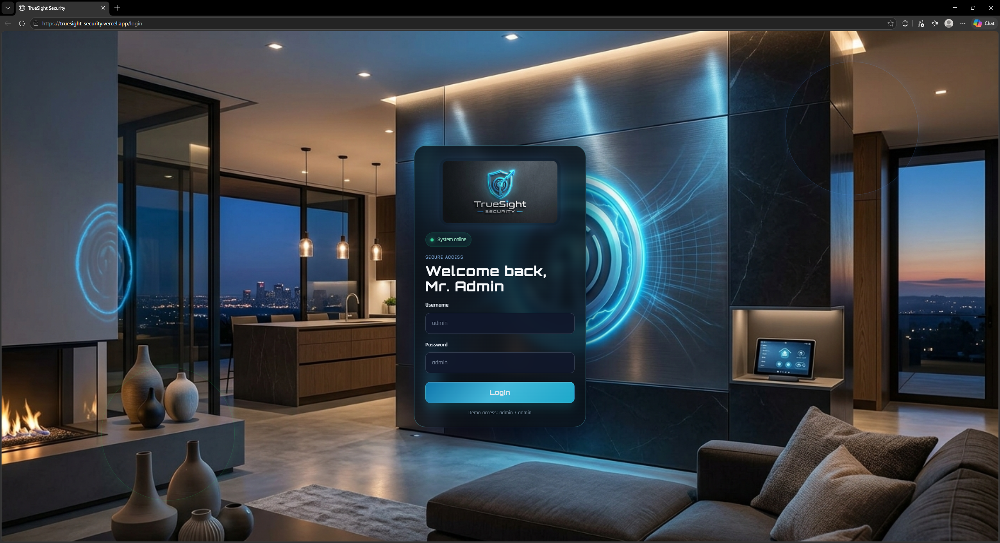
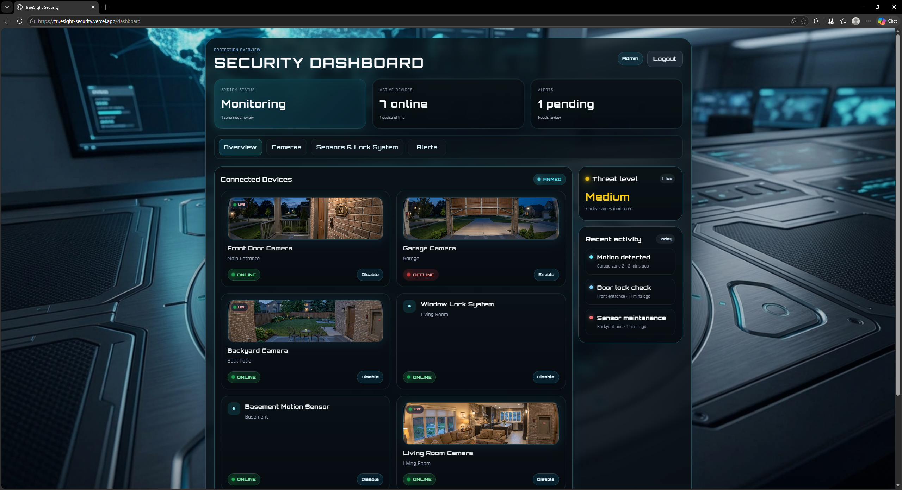

# TrueSight Security Dashboard

The TrueSight Security Dashboard is a high-tech security monitoring system designed for home or office protection.

It lets operators monitor live camera feeds, check sensor and lock statuses, toggle system alarm modes (armed/disarmed), and track real-time security alerts and threat levels through a single interface.

## Live Demo

- ctrl + click link
- <a href="https://truesight-security.vercel.app/" target="_blank" rel="noopener noreferrer">Click <u>Here</u> for live demo.</a>

## Overview

TrueSight Security is a front-end security dashboard concept that simulates a modern monitoring system for home or office protection. It includes a secure login screen, live camera cards, sensor and lock system status, threat monitoring, and an admin-style dashboard layout with strong cyber visuals.

## Screenshots

### Login Page

### Dashboard

## Features

- Secure login experience with admin credentials
- Protected dashboard routing using auth checks
- Live-looking camera cards with preview images
- Connected sensors and lock-system monitoring
- Threat level indicator
- Armed/disarmed system state control
- Active alerts and recent activity panel

## Tech Stack

- React
- Vite
- JavaScript
- React Router
- CSS / custom styling
- Vitest
- Testing Library
- ESLint

## Demo Credentials

- Username: admin
- Password: admin
